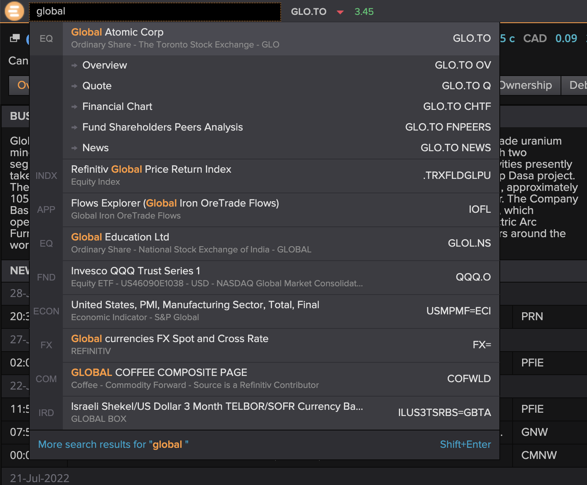

# Eikon Python API Wrapper

## Project Overview

Welcome to the future of writing a quantitative Project and Master's thesis at the Institute for Industrial Economy (or whatever else you want to use these tools for, feel free). Two former Indøk students created this repository. During our work on the Master's thesis, we created the precursor to the code to make collecting large amounts of financial data as easy as possible. In this repo, we have tried to provide a generalized system that allows easy access to the most-used financial data (stocks, bonds, commodities), examples, and documentation. In short, this project we wished existed when we embarked on our Master's journey on a dark and cold March night in 2022.

This project assumes some basic knowledge of Eikon. For an in-depth guide to using Eikon together with the Excel plugin to extract bond data, see [Fosse (2021)](https://docs.google.com/document/d/1KYKZ6Mcp7nYa3xAMIlHPpvCGj6XhV9Hm/edit?usp=sharing&ouid=102135063001800642455&rtpof=true&sd=true). That guide goes into deep detail on using the Excel plugin and could be wise to peruse when working with Eikon.

## Introduction to Eikon

Refinitiv Eikon (Eikon) is a solution for financial professionals to provide a wide array of financial information for several asset classes and geographies. Detailed and up-to-date information on equities (stocks), bonds, commodities, forex, and other macro-financial variables is available. For comparison, Eikon is similar to the well-renowned Bloomberg Terminal and serves the same purpose, only to a slightly lesser extent. However, the current project seeks to bridge the gap somewhat.

You can access the data through several avenues, e.g., an iPhone application, a Windows desktop application, a web interface, and an Excel plugin. However, the central research hub usually centers around the Widows application, often termed the "Terminal." Here, one can explore the data the system provides in a visual interface. Our main access point at Indøk (as of writing this guide in July 2022) is on a specific stationary computer found in the southwest corner of the computer room on the third floor of Kjelhuset. In addition, there are several more terminals situated at the Handelshøyskolen.

For example, one can search for specific companies in the search bar at the top-left and explore all available information for that company, like historical prices, multiples, peers, fundamentals, and news. One can also use a screening tool to find a list of companies fulfilling an arbitrary list of criteria. For example, one can automatically find all stocks within a specific revenue range in a particular sector. Then, one can extract any information available for that list of companies.

For example, one can navigate to the company's chart page and export the data to get stock data on a specific company. However, this method is very tedious when one wants data for several companies. The most common solution to this issue is to use the Excel plugin. This plugin allows one to define the tickers and fields one wants and copy-paste formulas in a range to get data for all tickers and all required data items. For example, one can have a list of company tickers in one column and a list of data points one wants for those companies (revenue, EBIT, etc.) in a row. Then, with the help of the formula-builder, one can create a formula that references the tickers and data item names in the rows and columns and gets that data.

### The Eikon Data Item Browser

The most important part of the Eikon data platform to work with in conjunction with the API is the Data Item Browser. We adapted the following from Fosse (2021):

> The Data item browser is a tool to browse data items (Eikon uses the term data item for a type of information regarding an instrument). To find the Data Item Browser, search for it in the top left search field. When entering a ticker, you can see all available data items. This feature helps explore the data available for that instrument and how Eikon represents the data. Then use the Formula Builder to extract that data item using its Data Item Code.

> **Tip:** To find what you are searching for more efficiently, use the options in the right corner. Displaying blank values can be helpful as they may not be empty for other relevant instruments. At the bottom, you can sort for relevance and A-Z. In my experience, Eikon may not share your perception of relevance so that A-Z can be useful.

### Getting the Python API up and running

We have condensed and adapted this section from the [official documentation](https://developers.refinitiv.com/en/api-catalog/eikon/eikon-data-api/quick-start).

#### 1. Start the Eikon desktop program on the accessing computer.

#### 2. Create an app key for your application

1. Search for "app key" in the Eikon search bar and navigate to the "App Key Generator" page.
2. Once there, click the _"Register New App"_ button to create your key.
3. Give it a suitable name (preferably something identifying you and when you're writing your thesis so administrators can safely delete your key once you're long gone into consulting or banking to do the devil's bidding) and check _"Eikon Data API"_ as the API access.
4. Click register and accept the terms and conditions (Important! Read all the terms before accepting!)
5. Your app key should appear. Go ahead and copy that for later.

#### 3. Install the Eikon package and register with the app key

Here, we assume you've leveraged your vast Python experience from TDT4110 — Information Technology, Introduction to set up the basic Python environment. The easiest way to get started in the present context is with Anaconda since this distribution already has Pandas and Numpy installed.

1. Install the `eikon` package by running the command `pip install eikon`.
2. Make sure the `eikon` package is imported with the command `import eikon as ek`
3. Register the code with Eikon with the command `ek.set_app_key('8e5a3xxxxxxxxxxxxxxxxxxxxxxxxxxxx21b031c')`

You are now ready to start using the Eikon Python API (or our extension of it)

## Why should we use the Eikon API?

Some basic information on the official Eikon Python package we base this project on can be found [here](https://pypi.org/project/eikon/). More in-depth documentation of the API is in [this pdf](./documentation/eikon_data_api_for_python_v1.pdf).

One important reason for using the API instead of the Excel plugin is because of some critical limitations of Excel/Eikon:

- Eikon only allows fetching of data or 7 500 tickers (companies, bonds, commodities, etc.) at a time—getting more means creating several Excel sheets and merging them manually.
- Excel only accommodates a little over one million rows and 16 000 columns—very little in our modern big-data age—and if more is required, tough luck solving it with Excel.
- Excel is slow and inflexible when handling and manipulating data and fetching data from Eikon's servers, especially when the number of rows grows.
- Excel is not particularly well suited for getting and working with time-series data.
- Requesting data with Excel requires a lot of manual manipulation of the rows, columns, and formulas to get data—Python is much more flexible and automatable.

## But Eikon already has a Python API. So why does this project exist?

Eikon has a python package that allows one to get data with Python. However, they have not made it easy for people to use—instead, the opposite—at times, it seems like they have tried to make users' lives as hard as possible. Still, the gang over at Refinitiv claims this about their Python API wrapper:

> The Eikon Data API Python library is an ease of use library, which conveniently wraps the raw message transcription between Eikon and Python and provides user friendly data retrieval calls. The data output from the Eikon Data API Python library is available as Pandas DataFrames or as JSON objects.

This is wrong. There is no ease of use, and the package feels outright hostile to users.

This project, then, generalizes much of the code we painstakingly arrived at through countless hours of debugging Eikon errors. You can, of course, ask, "What's the point if it's so hard?" We agree, but if you want large amounts of up-to-date financial data, there is no other source available to us than Eikon (as far as we know), and Excel does just not cut it.

### Some issues to be aware of in the vanilla Eikon API

- There are two main methods to get time-series data: `get_data` and `get_timeseries`. When one shall use each function is not intuitive.
- Eikon tends to time out or throws errors when requesting a lot of data. Such timeouts often occur because one asks for too much data. Too much could entail requesting too many items or sending too many requests per day. Eikon does not tell which it is when throwing a timeout error.
- When using `ek.get_timeseries`, the available fields vary with what type of data you request. For example, when requesting stock quotes, "CLOSE" and "OPEN" are available, while "VALUE" is not. When getting macro series, the "VALUE" field is populated while all the others are not.

### How we addressed the issues

We have tried to address the main pain points we experienced in the making our Master's. Our solution involves code that simplifies the dichotomy between the two data functions, handles batching and waiting when getting large amounts of data overnight, and manages common errors.

## Other Eikon

- Finding fields: Select a small set of tickers and all data items that might interest you. Then, run `get_data` without specifying a filename and inspect the resulting data frame to see which data items are valid for this kind of entity.

## Overview of Python package

## Examples

### Equity

### Bonds

### Macro

## Sources

Fosse, Henrik Giske (2021), _"The complete guide to extracting bond data from Eikon (as far as I know)."_
