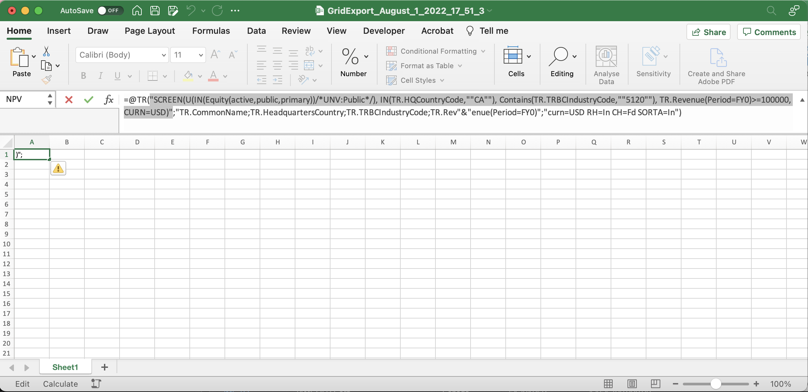

# Eikon Python API Wrapper

> Feel free to fork this repo if you want to play around with the code. Also, please don't hesitate to open pull requests to the repo if you have improved the code.

## Project Overview

Welcome to the future of writing a quantitative Project and Master's thesis at the Department of Industrial Economics and Technology Management (or whatever else you want to use these tools for, feel free). Two former Indøk students created this repository. During the work on our Master's thesis [(Ankile & Krange, 2022)](##Sources), we created the precursor to the code to make collecting large amounts of financial data as easy as possible. In this repo, we have tried to provide a generalized system that allows easy access to the most-used financial data (stocks, bonds, commodities), examples, and documentation. In short, this is the project we wished existed when we embarked on our Master's journey on a dark and cold March night in 2022.

This project assumes some basic knowledge of Eikon. For an in-depth guide to using Eikon together with the Excel plugin to extract bond data, see [Fosse (2021)](##Sources). That guide goes into deep detail on using the Excel plugin and could be wise to peruse when working with Eikon.

## Introduction to Eikon

Refinitiv Eikon (Eikon) is a solution for financial professionals to provide a wide array of financial information for several asset classes and geographies. Detailed and up-to-date information on equities (stocks), bonds, commodities, forex, and other macro-financial variables is available. For comparison, Eikon is similar to the well-renowned Bloomberg Terminal and serves the same purpose, only to a slightly lesser extent. However, the current project seeks to bridge the gap somewhat.

You can access the data through several avenues, e.g., an iPhone application, a Windows desktop application, a web interface, and an Excel plugin. However, the central research hub usually concentrates around the Windows application, often termed the "Terminal." Here, one can explore the data provided by the system in a visual interface. Our main access point at Indøk (as of writing this guide in July 2022) is on a specific stationary computer found in the southwest corner of the computer room on the third floor of Kjelhuset (Gløshaugen, NTNU, Trondheim). In addition, there are several more terminals situated at the Handelshøyskolen.

For example, one can search for specific companies in the search bar at the top-left and explore all available information for that company, like historical prices, multiples, peers, fundamentals, and news. One can also use a screening tool to find a list of companies fulfilling an arbitrary list of criteria. For example, one can automatically find all stocks within a specific revenue range in a particular sector and then extract any information available for that list of companies.

For example, one can navigate to the company's chart page and export the data to get stock data on that specific company. However, this method is very tedious when one wants data for several companies. The most common solution to this issue is to use the Excel plugin. This plugin allows one to define the tickers and fields one wants and copy-paste formulas in a range to get data for all tickers and all required data items. For example, one can have a list of company tickers in one column and a list of characteristics for those companies (revenue, EBIT, etc.) in a row. Then, with the help of the formula-builder, one can create a formula that references the tickers and data item names in the columns and rows and gets that data.

### The Eikon Data Item Browser

The most important part of the Eikon data platform to work with in conjunction with the API is the Data Item Browser. We adapted the following from Fosse (2021):

> The Data item browser is a tool to browse data items (Eikon uses the term data item for a type of information regarding an instrument). To find the Data Item Browser, search for it in the top left search field. When entering a ticker, you can see all available data items. This feature helps explore the data available for that instrument and how Eikon represents the data. Then, use the Formula Builder to extract that data item using its Data Item Code.

> **Tip:** To find what you are searching for more efficiently, use the options in the right corner. Displaying blank values can be helpful as they may not be empty for other relevant instruments. At the bottom, you can sort for relevance and A-Z. From experience, Eikon may not share your perception of relevance so that A-Z can be useful.

### Getting the Python API up and running

We have condensed and adapted this section from the [official documentation](https://developers.refinitiv.com/en/api-catalog/eikon/eikon-data-api/quick-start).

#### 1. Start the Eikon desktop program on the accessing computer.

On the computer at "Finanssal" at Kjelhuset, the easiest is probably to press the windows key and search for Eikon.

#### 2. Create an app key for your application

1. Search for _"app key"_ in the Eikon search bar and navigate to the "App Key Generator" page.

2. Once there, create your key by filling out the info at the top of the page. Please, give it a suitable name (preferably something identifying you and when you're writing your thesis. This way, administrators can safely delete your key once you're long gone (into consulting or banking to do the devil's bidding)) and check _"Eikon Data API"_ as the API access. Finally, click the _"Register New App"_ button to create your key.

4. Accept the terms and conditions (Important! Read all the terms and conditions before accepting them!)

5. Your app key should appear. Go ahead and copy that for later.
   

#### 3. Install the Eikon package and register with the app key

We assume you've leveraged your vast Python experience from TDT4110 — Information Technology, to set up the standard Python environment. The easiest way to get started in the present context is with [Anaconda](https://www.anaconda.com/products/distribution) since this distribution already has Pandas and Numpy installed.

1. Install the `eikon` package by running the command `pip install eikon`.
2. Ensure you import the `eikon` package with the command `import eikon as ek`.
3. Register the code with Eikon with the command `ek.set_app_key('420a3xxxxxxxxxxxxxxxxxxxxxxxxxxxx216969c')`.

You are ready to use the Eikon Python API (or our extension).

## Why should we use the Eikon API?

Some basic information on the official Eikon Python package we base this project on can be found [here](https://pypi.org/project/eikon/). More in-depth documentation of the API is in [this pdf](./documentation/eikon_data_api_for_python_v1.pdf).

One important reason for using the API instead of the Excel plugin is because of some critical limitations of Excel/Eikon:

- Eikon only allows fetching of data or 7 500 tickers (companies, bonds, commodities, etc.) at a time—getting more means creating several Excel sheets and merging them manually.
- Excel only accommodates a little over one million rows and 16 000 columns—very little in our modern big-data age—and if more is required, tough luck solving it with Excel.
- Excel is slow and inflexible when handling and manipulating data and fetching data from Eikon's servers, especially when the number of rows grows.
- Excel is not particularly well suited for getting and working with time-series data.
- Fetching data with Excel requires manual manipulation of the rows, columns, and formulas to get data—Python is much more flexible and automatable.

## But Eikon already has a Python API. So why does this project exist?

Eikon has a python package that allows one to get data with Python. However, they have not made it easy for people to use—instead, the opposite—at times, it seems like they have tried to make users' lives as hard as possible. Still, the gang over at Refinitiv claims this about their Python API wrapper:

> "The Eikon Data API Python library is an ease-of-use library that conveniently wraps the raw message transcription between Eikon and Python and provides user-friendly data retrieval calls. The data output from the Eikon Data API Python library is available as Pandas DataFrames or as JSON objects."

I'm afraid that's not right. There is no ease of use, and the package feels outright hostile to users.

This project, then, generalizes much of the code we painstakingly arrived at through countless hours of debugging Eikon errors. You can, of course, ask, "What's the point if it's so hard?" We agree, but if you want large amounts of up-to-date financial data, there is no other source available to us than Eikon (as far as we know), and Excel does just not cut it.

### Some issues to be aware of in the vanilla Eikon API

- There are two main methods to get time-series data: `get_data` and `get_timeseries`. When one shall use each function is not intuitive.
- Eikon tends to time out or throw errors when requesting much data. Such timeouts often occur because one asks for too much data. Too much could entail requesting too many items or sending too many requests per day. Eikon does not tell which it is when throwing a timeout error.
- When using `ek.get_timeseries`, the available fields vary with what type of data you request. For example, when requesting stock quotes, "CLOSE" and "OPEN" are available, while "VALUE" is not. When getting macro series, the "VALUE" field is populated while all the others are not.
- Eikon tended to be a little sloppy with our date boundaries. For example, rows with duplicated dates appeared or dates that were before the start date specified. One can easily remove these cases after getting data but be aware that this can happen and act accordingly.
- Beware of the frequency of the data you are requesting. For example, asking for market capitalization data (typically recorded daily) and revenue (reported quarterly) can give weird results. It is, therefore, best to get market cap and fundamentals in separate queries.

### How we addressed the issues

We have tried to address the main pain points we experienced while doing our Master's. Our solution involves code that simplifies the dichotomy between the two data functions, handles batching and waiting when getting large amounts of data overnight, and manages common errors.

## Overview of Python package

This package centers around the `get_data` function, a strong data collection tool. The function wraps the standard Eikon API calls in logic that handles splitting requests and delegating to Eikon's two underlying data retrieval functions (`ek.get_data` and `ek.get_timeseries`). 

The package also offers some documentation on screening, which we describe first as in usage of the eikon_wrapper package the screening would naturally precede a call of `get_data`.

### The Screening Tool

The screening tool is mainly a helper to ensure one's screening criteria make sense by showing the user a list of all company names that match the screening criteria. This list, which we subsequently use in the requests for data, makes it predictable what tickers one requests data for and how much to expect.

#### Eikon Screening Syntax

Eikon uses a proprietary syntax to define the criteria for which companies to include in the results. It is relatively straightforward to read but less so to write. As an example, if you want data for all public Norwegian oil-related companies (sector code 5010, 5020, 5030) with revenue larger than USD 500 000, you can use the following screening string: `'SCREEN(U(IN(Equity(active,public,primary))), TR.CompanyMarketCap>=500000, IN(TR.ExchangeMarketIdCode,"XOSL"), IN(TR.TRBCBusinessSectorCode,"5010","5020","5030"), CURN=USD)'`.

#### Building Eikon Screening Strings (2 methods)

##### 1. Manually with the Data Item Browser

When getting data for our Master's, we resorted to manually writing out the screening string, which works well for simple screens. The best way to do this is to start with an expression that resembles what you need and modify it. Our good old friend, the Data Item Explorer, is great for finding the relevant data item names and values for which one wants to screen.

For example, if one wants to change the above screen to include mining companies with headquarters in Canada and revenue above USD 100 000, one could do the following.

1. Go to the Data Item Browser and insert a company that you know fits your criteria in the "Instrument" box at the top.
2. Search for the criteria you want to screen for (business sector and headquarters location in this case).

3. In the search result table, the second column gives you the name of the data item to screen with, and the third column shows the appropriate value for that criteria.
4. Lastly, substitute the values found in the Data Item Browser into the screening string, and test it out in the screening function.

For the example in question, the above procedure results in the following screening string: `'SCREEN(U(IN(Equity(active,public,primary))), TR.Revenue>=100000, IN(TR.HeadquartersCountry,"Canada"), IN(TR.TRBCBusinessSectorCode,"5120"), CURN=USD)'`

##### 2. Through the Eikon Equity Screening tool

One can utilize the Eikon equity screening tool to create more complex screening queries or start from scratch. Again, let us say we will develop the same screen as above. For that, follow these steps.

1. Search for _"screen"_ in the search bar and go to the app called _"Screener"_.
2. On the left-hand side, one can choose from a long list of screening ideas or create a new screen.
3. Search for data items, specify values ranges in the bar on the left, and see what companies qualify as you progress.

4. Once you are happy with the screen, press the arrow to the right of the Excel icon in the top right and choose _"Export all as formulas"_.
5. Open the Excel file and copy the contents of the cell that contains the formula (only the first argument to the `@TR()` function). You can now use this string in our screening code (or elsewhere).

The resulting screening string from the above example is `'SCREEN(U(IN(Equity(active,public,primary))/*UNV:Public*/), IN(TR.HQCountryCode,"CA"), Contains(TR.TRBCIndustryCode,"5120"), TR.Revenue(Period=FY0)>=100000, CURN=USD)'`. Here, one can see that the Eikon screener tool added some small modifications. These can be removed or kept as one likes.

### The Data Downloading Tool

The meat of the project is the `get_data` function, which handles a lot of the heavy lifting. The signature is `get_data(lst_of_tickers, fields, params, filename=None) -> pd.DataFrame, pd.DataFrame` and the arguments are as follows:

- `lst_of_tickers`: A list of strings, where each value is the Eikon ticker representing a variable one wants data for (e.g., "GLO.TO," i.e., ticker GLO listed on the Toronto Stock Exchange). The easiest way to get this ticker list is through the screening function described above. One can also search for specific tickers using the built-in search tool of Eikon (e.g. "BRT-" for Brent Spot). 
- `fields`: A list of strings. Each string is the code for an Eikon data item. The best way to find these data items is in the [Data Item Browser](###The-Eikon-Data-Item-Browser). Leaving this blank will return some interesting values as defined by Eikon (e.g. "VALUE" or "CLOSE, for different asset classes). 
- `params`: A dictionary containing the parameters for the data request. These parameters include start and end date, currency, and data frequency. The params available change for different tickers, using the data item browser is your best bet if you are looking for some very specific parameter in your call. 
- `filename`: A string that, if provided, specifies the filename to which the tool should save the resulting data frame. If omitted, the code will not create a saved CSV and only return the data frame in memory.

All the code the tool relies on is available in the cells above the cells containing `get_data`. If you want to use the Eikon API for something slightly different than us, please feel free to peruse the code to see how you can use the underlying `eikon` package.

The `get_data` function dynamically helps you get both time series data and company metadata like founding year and business sector. In most cases, one needs to define a universe of securities one wants data for, a set of data items, and a period (including the sampling frequency). Please see the examples below for inspiration on how you can do this. They include a sample with stock data, one with bonds data, and one with macro financial and commodity data.

## General tips for using the tool

- **Finding fields:** Select a small set of tickers and all data items that might interest you. Then, run `get_data` without specifying a filename and inspect the resulting data frame to see which data items are valid for this kind of entity.

- **See the examples:** We strongly suggest that you take a quick look at some of the examples we supply in the `data_collecton.ipynb`. The concrete examples will hopefully reduce some basic input errors.  

- **Sanity check data:** Be careful to check the data being returned, often one needs curious parameters for a function call to return what one is actually interested in. Furthermore, there are entries in the database that simply make little sense, check your data frame for standard weird values (e.g. in our experiments with 1600 stocks, with quarterly data over 20 years, TR.TotalAssets == 0 returned true for a single entity at a single time point).

- **Multiple calls are often the solution:** When collecting data of different dimensionality using multiple calls is often a good solution. E.g. get daily stock data in one call, and fundamental data in another. Combine them locally afterwards.

- **Experiment!:** Eikon has so much data to do interesting things with, don't be afraid to try multiple different
 calls and explore using the Data Item Browser. 

## Examples

See [Data collection examples](https://github.com/Krankile/eikon-wrapper/blob/main/data_collection.ipynb)

## Sources

Ankile, Lars L. & Krange, Kjartan 2022 _"Krankile/npmf GitHub repo"_ [https://github.com/Krankile/npmf](https://github.com/Krankile/npmf)

Fosse, Henrik G. (2021), _"The complete guide to extracting bond data from Eikon (as far as I know)."_ [[https://docs.google.com/document/d/1KYKZ6Mcp7nYa3xAMIlHPpvCGj6XhV9Hm/edit?usp=sharing&ouid=102135063001800642455&rtpof=true&sd=true](https://github.com/Krankile/eikon-wrapper/blob/main/The%20complete%20guide%20to%20extracting%20bond%20data%20from%20EIKON_OnlineVersion%20(1).pdf)](https://github.com/Krankile/eikon-wrapper/blob/main/The%20complete%20guide%20to%20extracting%20bond%20data%20from%20EIKON_OnlineVersion%20(1).pdf)
